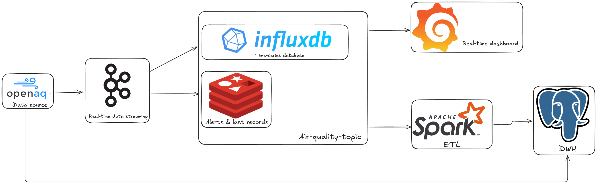

# Kafka Air Quality Pipeline

A real-time data streaming pipeline for processing air quality data using Apache Kafka, with multiple storage backends and visualization capabilities.

## 🏗️ Architecture


The pipeline ingests air quality data from OpenAQ, streams it through Kafka, and distributes it to multiple consumers for different purposes:
- **InfluxDB**: Time-series storage for real-time monitoring
- **Redis**: Fast access to alerts and latest records
- **Apache Spark**: ETL processing for data warehouse storage

## 📋 Features

- **Real-time Data Streaming**: Continuous ingestion of air quality data from OpenAQ API
- **Multi-Consumer Architecture**: Parallel processing with InfluxDB and Redis consumers
- **Time-Series Storage**: InfluxDB for efficient time-series data management
- **Alert System**: Redis-based storage for alerts and latest records
- **Real-time Visualization**: Grafana dashboards for monitoring air quality metrics
- **ETL Pipeline**: PySpark-based ETL for data warehouse integration (coming soon)
- **Scalable Design**: Kafka-based architecture for horizontal scaling

## 🛠️ Tech Stack

### Core Technologies
- **Java 17**: Main application runtime
- **Apache Kafka 3.6.0**: Message streaming platform
- **Kafka KRaft Mode**: Simplified Kafka deployment without ZooKeeper

### Storage & Databases
- **InfluxDB 3.x**: Time-series database for metrics storage
- **Redis 4.4.3**: In-memory data store for alerts and caching
- **Data Warehouse**: Target for PySpark ETL (PostgreSQL/Snowflake/etc.)

### Data Processing
- **Apache Spark**: ETL processing (PySpark implementation)
- **Jackson 2.15.2**: JSON serialization/deserialization

### Monitoring & Visualization
- **Grafana**: Real-time dashboard and visualization

### Additional Libraries
- **Lombok**: Boilerplate code reduction
- **dotenv-java**: Environment variable management
- **SLF4J**: Logging framework

## 📁 Project Structure

```
Kafka-AirQulity-Pipeline/
├── src/
│   └── main/
│       └── java/
│           └── org/
│               └── pipeline/
│                   ├── producers/      # Kafka producers (OpenAQ data ingestion)
│                   └── consumers/      # Kafka consumers (InfluxDB, Redis)
├── docker-compose.yaml                 # Kafka container configuration
├── pom.xml                             # Maven dependencies
├── .env                                # Environment variables
└── README.md
```

## 🚀 Getting Started

### Prerequisites

- Java 17 or higher
- Maven 3.6+
- Docker & Docker Compose
- InfluxDB instance (local or cloud)
- Redis instance (local or cloud)
- Grafana instance (for visualization)

### Installation

1. **Clone the repository**
   ```bash
   git clone <repository-url>
   cd Kafka-AirQulity-Pipeline
   ```

2. **Configure environment variables**
   
   Create a `.env` file in the project root:
   ```env
   INFLUXDB_TOKEN=your_influxdb_token
     
   OPENAQ_API_KEY=your_api_key (if required)
   ```

3. **Start Kafka using Docker Compose**
   ```bash
   docker-compose up -d
   ```

4. **Build the project**
   ```bash
   mvn clean install
   ```

## 📊 Grafana Dashboard Setup

1. **Add InfluxDB as a data source in Grafana**
   - Navigate to Configuration → Data Sources
   - Add InfluxDB data source
   - Configure connection details (URL, token, organization, bucket)

2. **Import or create dashboards**
   - Create visualizations for air quality metrics (PM2.5, PM10, CO2, etc.)
   - Set up real-time monitoring panels
   - Configure alerts based on threshold values

3. **Recommended Dashboard Panels**
   - Time-series graphs for pollutant levels
   - Gauge panels for current readings
   - Geographic maps for sensor locations
   - Alert status indicators

## 🔄 PySpark ETL Pipeline (Coming Soon)

The PySpark ETL component will:
- Read data from Kafka topics
- Transform and aggregate air quality metrics
- Load processed data into a data warehouse
- Support batch and streaming processing modes
- Enable historical analysis and reporting

### Planned Features
- Data quality validation
- Aggregations (hourly, daily, monthly)
- Anomaly detection
- Data enrichment with external sources

## 🐳 Docker Commands

Start Kafka:
```bash
docker-compose up -d
```

Stop Kafka:
```bash
docker-compose down
```

View Kafka logs:
```bash
docker logs -f kafka
```

## 📝 Data Flow

1. **Data Ingestion**: OpenAQ API provides real-time air quality measurements
2. **Kafka Producer**: Fetches data from OpenAQ and publishes to Kafka topic
3. **Kafka Stream**: Distributes messages to multiple consumers
4. **InfluxDB Consumer**: Stores time-series data for visualization
5. **Redis Consumer**: Caches alerts and latest records for fast access
6. **Grafana**: Queries InfluxDB for real-time dashboard visualization
7. **PySpark ETL**: Processes data for data warehouse storage (future)

## 🔧 Configuration

### Kafka Configuration
- **Bootstrap Servers**: `localhost:9092`
- **Mode**: KRaft (no ZooKeeper required)
- **Auto Topic Creation**: Enabled
- **Replication Factor**: 1 (single node)

### Consumer Groups
- `influxdb-consumer-group`: InfluxDB consumer
- `redis-consumer-group`: Redis consumer

## 🧪 Testing

Run unit tests:
```bash
mvn test
```

## 📈 Monitoring

- **Kafka**: Monitor through JMX metrics or Kafka Manager
- **InfluxDB**: Built-in monitoring UI
- **Redis**: Use Redis CLI or Redis Insight
- **Grafana**: Custom dashboards for application metrics

## 🤝 Contributing

Contributions are welcome! Please feel free to submit a Pull Request.

## 📄 License

This project is licensed under the MIT License.

## 🔗 Resources

- [Apache Kafka Documentation](https://kafka.apache.org/documentation/)
- [InfluxDB Documentation](https://docs.influxdata.com/)
- [Grafana Documentation](https://grafana.com/docs/)
- [OpenAQ API](https://openaq.org/)
- [Apache Spark Documentation](https://spark.apache.org/docs/latest/)

## 📧 Contact

For questions or support, please open an issue in the repository.
