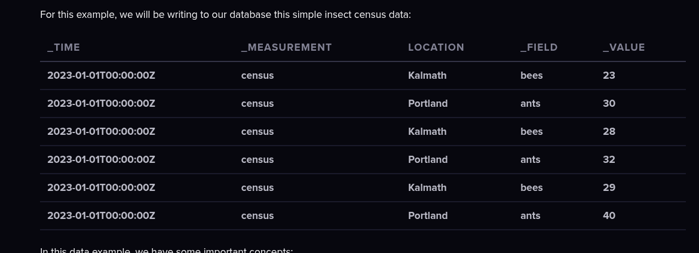

| Parameter | Meaning                                               |
| --------- | ----------------------------------------------------- |
| `pm25`    | Fine particulate matter ≤ 2.5µm (dangerous for lungs) |
| `pm10`    | Particulate matter ≤ 10µm                             |
| `co`      | Carbon monoxide                                       |
| `no2`     | Nitrogen dioxide                                      |
| `o3`      | Ozone                                                 |
| `so2`     | Sulfur dioxide                                        |
| `bc`      | Black carbon                                          |
